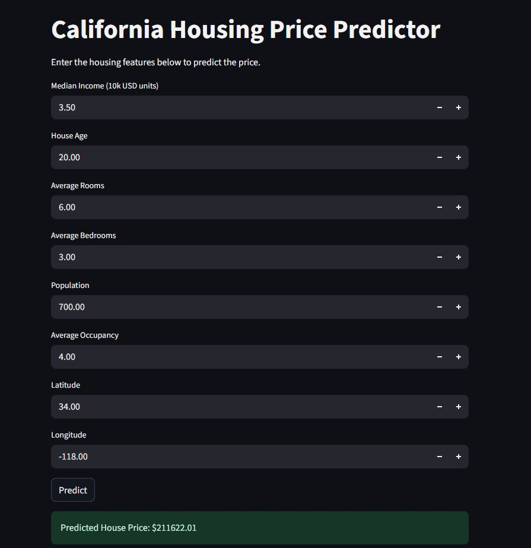

# 🏠 Housing Price Prediction using Machine Learning

This project uses the **California Housing dataset** to build and deploy a **machine learning model** that predicts housing prices. The model is trained using scikit-learn and deployed with a simple web interface using **Streamlit**.

---

## 📁 Project Structure

```
├── app.py                 # Streamlit web app
├── Housing Price Prediction.ipynb   # Jupyter notebook for training & evaluation
├── model.pkl              # Trained Random Forest model (tracked with Git LFS)
├── scaler.pkl             # Scaler used during training (tracked with Git LFS)
├── requirements.txt       # Python dependencies
└── .gitattributes         # Git LFS tracking configuration
```

---

## 🚀 How to Run Locally

### 1. Clone the Repository
```bash
git clone https://github.com/yourusername/housing-price-streamlit.git
cd housing-price-streamlit
```

### 2. Install Requirements
```bash
pip install -r requirements.txt
```

### 3. Run the Streamlit App
```bash
streamlit run app.py
```


---

## 🌐 Deploying Online (Optional)
You can deploy this project for free using:
- [Streamlit Cloud](https://streamlit.io/cloud)

Just upload this project (including `.pkl` files) to a GitHub repo and connect it.

---

## 📊 Model Metrics
- **Model**: Random Forest Regressor
- **MAE**: Mean Absolute Error
- **MSE**: Mean Squared Error
- **R² Score**: Goodness of fit

These metrics are printed and displayed within the Jupyter notebook.

---

## 🛠 Requirements
- Python 3.x
- streamlit
- pandas
- numpy
- matplotlib
- seaborn
- scikit-learn
- joblib

Install all with:
```bash
pip install -r requirements.txt
```

---

## 👤 Author
**Aman Mohammed**  

---
## 📸 Screenshot


